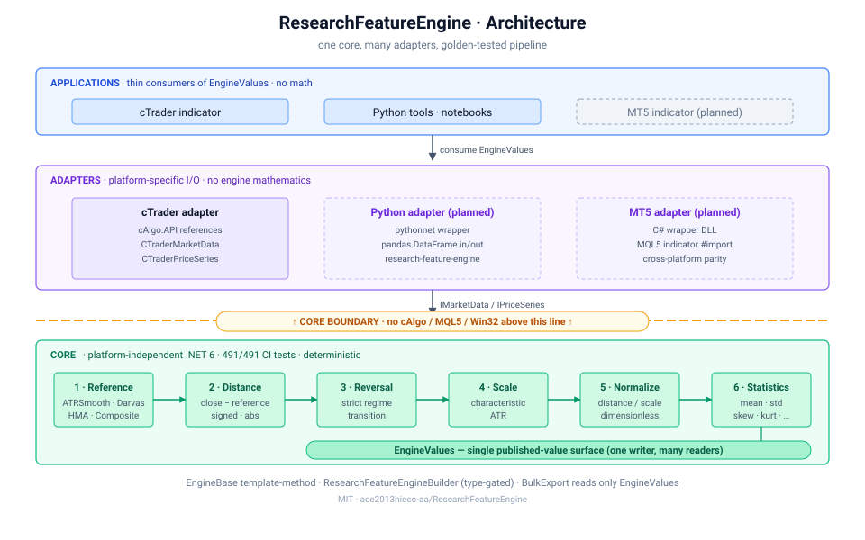

# ResearchFeatureEngine v0.1.0

First public release of the platform-independent quantitative research engine. The Core .NET 6 assembly now ships as a NuGet package, validated by 491 portable golden tests and published through OIDC trusted publishing — no API key stored in the repo.

## What's in this release

- **NuGet package:** [`ResearchFeatureEngine`](https://www.nuget.org/packages/ResearchFeatureEngine) on nuget.org
- **License:** MIT
- **CI:** every push and PR to `master` runs build + test
- **Tag-triggered publish:** pushing a `v*` tag publishes the package automatically

## Install

```bash
dotnet add package ResearchFeatureEngine --version 0.1.0
```

Then load the cTrader indicator from `Indicators/ResearchFeatureEngineIndicator/bin/Release/net6.0/ResearchFeatureEngineIndicator.algo` into cTrader Automate, or wire the Core into your own .NET 6 application.

## Architecture

A single `ResearchFeatureEngine` core drives every surface — cTrader today, Python and MT5 in upcoming releases — with the platform boundary enforced at the project-reference level (Core has zero `cAlgo` / `MQL5` dependencies).



See [`docs/architecture.svg`](docs/architecture.svg) for the layered view and the README for full documentation.

## Pipeline

`Market Data → Reference → Distance → (Darvas / HMA composites) → Regime Segment → Reversal → Scale → Normalization → Statistics → EngineValues`

Four reference models (`ATRSmooth2`, `DarvasBox`, `Hma`, `HmaAtrSmooth`) are selected at initialization via `ReferenceSourceFactory`. Every stage is an `EngineBase` with a Template-Method lifecycle, validated output, and single ownership inside `EngineValues`.

## Testing

- **491 portable tests** pass in CI (xUnit, .NET 10)
- **5 source-identity tests** (`V11_10`–`V11_12`) pin private local captures and run only on the author's machine
- Hand-computed golden oracles per reference source, determinism on 100k bars, real-market-data validation over 10k EURUSD M1 bars

## Roadmap

- **v0.2.0** — Python adapter (`pip install research-feature-engine`), pythonnet wrapper, PyPI release
- **v0.3.0** — MT5 indicator, C# wrapper DLL + MQL5 indicator + cross-platform parity tests

`MT4` is explicitly out of scope.

## Full Changelog

See [`CHANGELOG.md`](CHANGELOG.md).